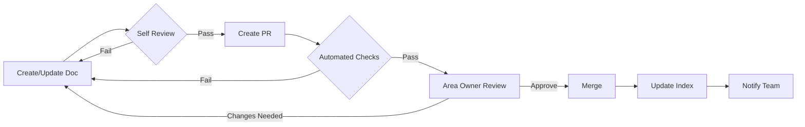

# DOCUMENTATION_GOVERNANCE

*Status: Active*  
*Author: Documentation Team*  
*Canonical: Yes*

## Overview

Documentation for DOCUMENTATION_GOVERNANCE

---
# Documentation Governance for Mugiwara-Kaizoku

> Established: January 2025  
> Purpose: Ensure documentation quality, consistency, and sustainability

## 📋 Table of Contents

1. [Documentation Owners](#documentation-owners)
2. [Maintenance Schedule](#maintenance-schedule)
3. [Review Process](#review-process)
4. [Quality Standards](#quality-standards)
5. [Update Workflows](#update-workflows)
6. [Monitoring & Metrics](#monitoring--metrics)
7. [Best Practices](#best-practices)
8. [Enforcement](#enforcement)

## Documentation Owners

### Area Ownership Model

Each documentation area has an assigned owner responsible for:
- Maintaining accuracy and consistency
- Reviewing changes
- Resolving conflicts
- Quarterly audits

### Current Owners

| Area | Owner | Backup | Responsibilities |
|------|-------|--------|------------------|
| **Architecture** | Lead Developer | Senior Dev | Type system, patterns, core concepts |
| **Integrations** | Integration Lead | Backend Dev | AniList, downloaders, external APIs |
| **Testing** | QA Lead | Test Engineer | Test patterns, guides, coverage |
| **Build/Deploy** | DevOps Lead | Platform Eng | Build system, Docker, deployment |
| **API** | API Lead | Backend Dev | API docs, endpoints, contracts |
| **Frontend** | Frontend Lead | UI Dev | Components, UI patterns, state |
| **Authentication** | Security Lead | Backend Dev | Auth flows, security docs |
| **Migration** | Tech Lead | Senior Dev | Migration guides, versioning |

### Rotation Schedule

- Owners rotate every 6 months
- Backup becomes primary owner
- Knowledge transfer: 2-week overlap
- Review meeting before rotation

## Maintenance Schedule

### Daily Tasks
- **Monitor**: Check CI/CD documentation validation results
- **Triage**: Address urgent documentation issues
- **Update**: Fix broken links reported by automated tools

### Weekly Tasks

| Day | Task | Owner | Time |
|-----|------|-------|------|
| **Monday** | Review weekend CI reports | All Owners | 30 min |
| **Tuesday** | Update cross-references | Rotating | 1 hour |
| **Wednesday** | Validate examples/code | Area Owners | 2 hours |
| **Thursday** | Process doc PRs | All Owners | 1 hour |
| **Friday** | Weekly report & planning | Doc Lead | 1 hour |

### Monthly Tasks

| Week | Task | Participants | Duration |
|------|------|--------------|----------|
| **Week 1** | Full documentation audit | All Owners | 4 hours |
| **Week 2** | Archive outdated content | Doc Team | 2 hours |
| **Week 3** | Update canonical docs | Area Owners | 2 hours |
| **Week 4** | Metrics review & planning | Leadership | 1 hour |

### Quarterly Tasks

1. **Comprehensive Review** (Week 1)
   - Full documentation tree audit
   - Consistency check across all docs
   - Update templates and standards
   - Duration: 8 hours

2. **Training & Onboarding** (Week 2)
   - Team training on documentation standards
   - Onboarding guide updates
   - New contributor orientation
   - Duration: 4 hours

3. **Process Improvement** (Week 3)
   - Review governance effectiveness
   - Update automation tools
   - Gather team feedback
   - Duration: 4 hours

4. **Strategic Planning** (Week 4)
   - Set next quarter priorities
   - Resource allocation
   - Tool evaluation
   - Duration: 2 hours

## Review Process

### Documentation Change Workflow



### Review Criteria

#### 1. Technical Accuracy
- [ ] Code examples tested and working
- [ ] API endpoints verified
- [ ] Type definitions correct
- [ ] Dependencies up to date

#### 2. Consistency
- [ ] Follows naming conventions
- [ ] Uses standard templates
- [ ] Matches canonical patterns
- [ ] Cross-references valid

#### 3. Completeness
- [ ] All sections populated
- [ ] Examples provided
- [ ] Edge cases covered
- [ ] Migration path clear

#### 4. Clarity
- [ ] Clear, concise writing
- [ ] Proper formatting
- [ ] Logical flow
- [ ] No ambiguity

### Review SLA

| Change Type | Review Time | Reviewers |
|-------------|-------------|-----------|
| **Typo/Minor** | 1 day | Any owner |
| **Content Update** | 2 days | Area owner |
| **New Document** | 3 days | Area owner + 1 |
| **Major Change** | 5 days | Area owner + Doc lead |

## Quality Standards

### Mandatory Requirements

1. **Structure**
   - Use appropriate template
   - Include table of contents
   - Add metadata header
   - Follow naming conventions

2. **Content**
   - Accurate technical information
   - Working code examples
   - Clear explanations
   - Current version references

3. **Format**
   - Proper markdown syntax
   - Consistent code formatting
   - Appropriate use of headers
   - Readable line length (80-120 chars)

4. **References**
   - Valid internal links
   - Working external URLs
   - Proper citations
   - Updated cross-references

### Quality Metrics

| Metric | Target | Current | Status |
|--------|--------|---------|--------|
| **Broken Links** | < 5 | 145 | 🔴 Needs Work |
| **Outdated Docs** | < 10% | 15% | 🟡 Improving |
| **Review Time** | < 3 days | 2.5 days | 🟢 Good |
| **Test Coverage** | > 90% | 85% | 🟡 Improving |
| **User Satisfaction** | > 80% | TBD | ⚪ Measure |

## Update Workflows

### Standard Update Process

1. **Identify Need**
   - Bug report
   - Feature change
   - User feedback
   - Audit finding

2. **Create Issue**
   ```markdown
   Title: [DOC] Update X documentation
   Labels: documentation, area-X
   Assignee: Area owner
   Priority: P0-P3
   ```

3. **Make Changes**
   - Branch: `docs/update-X`
   - Follow templates
   - Test examples
   - Update references

4. **Submit PR**
   ```markdown
   Title: docs: update X documentation
   Description: 
   - What changed
   - Why it changed
   - Impact on users
   - Testing done
   ```

5. **Post-Merge**
   - Update indexes
   - Notify affected teams
   - Monitor feedback
   - Close issue

### Emergency Updates

For critical documentation errors:

1. **Immediate Fix** (< 2 hours)
   - Direct commit to main (with approval)
   - Notify all stakeholders
   - Create follow-up issue

2. **Rapid Review** (< 24 hours)
   - Expedited PR review
   - Single approver needed
   - Auto-merge after checks

## Monitoring & Metrics

### Automated Monitoring

```bash
# Run daily via CI/CD
npm run docs:validate    # Link validation
npm run docs:check      # Reference checking
npm run docs:quality    # Quality metrics
```

### Key Performance Indicators

1. **Documentation Health**
   - Valid links: > 95%
   - Updated within 30 days: > 80%
   - Follows standards: > 90%

2. **Process Efficiency**
   - Average review time: < 3 days
   - First-time approval rate: > 70%
   - Automation coverage: > 80%

3. **User Impact**
   - Documentation-related issues: < 5%
   - Onboarding time: < 1 week
   - User satisfaction: > 80%

### Monthly Dashboard

```
Documentation Health Dashboard - January 2025
━━━━━━━━━━━━━━━━━━━━━━━━━━━━━━━━━━━━━━━━━━
📊 Overall Health: 78% ⬆️ (+5% from last month)

✅ Strengths:
- Review time: 2.5 days (target: 3)
- New docs using templates: 95%
- CI/CD automation: 100%

⚠️ Areas for Improvement:
- Broken links: 145 (target: <5)
- Outdated docs: 15% (target: <10%)
- Test coverage: 85% (target: >90%)

📈 Trends:
- Documentation updates: +23% 
- User questions: -15%
- Time to resolve: -20%
```

## Best Practices

### Writing Guidelines

1. **Be Concise**
   - One concept per document
   - Clear, direct language
   - Avoid redundancy

2. **Be Complete**
   - Cover common use cases
   - Include error handling
   - Provide troubleshooting

3. **Be Consistent**
   - Use standard terms
   - Follow patterns
   - Match code style

4. **Be Current**
   - Update with code changes
   - Remove outdated info
   - Version appropriately

### Code Examples

✅ **Good Example**:
```typescript
// Clear, working example with error handling
export async function fetchManga(id: string): AsyncResult<Manga> {
  try {
    const manga = await mangaService.getById(id);
    if (!manga) {
      return { success: false, error: 'Manga not found' };
    }
    return { success: true, data: manga };
  } catch (error) {
    return { success: false, error: error.message };
  }
}
```

❌ **Bad Example**:
```typescript
// Unclear, no error handling, outdated pattern
function getManga(id) {
  return mangaService.find(id); // Old API
}
```

### Common Pitfalls

1. **Documentation Drift**
   - Solution: Link docs to code
   - Use automated generation
   - Regular audits

2. **Over-Documentation**
   - Solution: Focus on "why" not "what"
   - Document decisions, not syntax
   - Link to external refs

3. **Under-Documentation**
   - Solution: Document edge cases
   - Include troubleshooting
   - Add migration guides

## Enforcement

### Compliance Monitoring

1. **Automated Checks**
   - Pre-commit hooks for formatting
   - CI/CD for validation
   - Weekly quality reports

2. **Manual Reviews**
   - Quarterly audits
   - Peer reviews
   - User feedback

3. **Consequences**
   - Blocked PRs for violations
   - Required training for repeated issues
   - Recognition for excellence

### Escalation Path

```
Issue Found → Area Owner (24h) → Doc Lead (48h) → Tech Lead (72h)
```

### Recognition Program

- **Doc Champion**: Monthly award for best contribution
- **Quality Star**: Quarterly recognition for consistency
- **Innovation Award**: Annual prize for process improvements

## Tools & Resources

### Required Tools

1. **Validation**
   - `npm run docs:validate` - Check all links
   - `npm run docs:lint` - Format checking
   - `npm run docs:spell` - Spell check

2. **Generation**
   - `npm run docs:generate` - Auto-generate API docs
   - `npm run docs:index` - Update search index
   - `npm run docs:map` - Generate site map

3. **Monitoring**
   - `npm run docs:health` - Health metrics
   - `npm run docs:report` - Monthly report
   - `npm run docs:audit` - Full audit

### Resources

- [Documentation Templates](./templates/README.md)
- [Writing Style Guide](./DOCUMENTATION_STYLE_GUIDE.md)
- [Contribution Guide](./DOCUMENTATION_CONTRIBUTION_GUIDE.md)
- [Naming Conventions](./DOCUMENTATION_NAMING_CONVENTIONS.md)

## Contact & Support

### Documentation Team

- **Slack**: #documentation
- **Email**: docs@mugiwara-kaizoku.dev
- **Office Hours**: Thursdays 2-3 PM

### Getting Help

1. Check [CANONICAL_DOCS.md](./CANONICAL_DOCS.md)
2. Search existing documentation
3. Ask in #documentation Slack
4. Create a documentation issue

---

**Last Updated**: January 2025  
**Next Review**: April 2025  
**Version**: 1.0.0