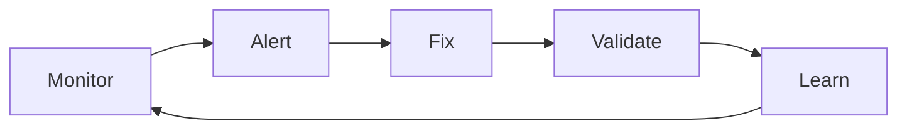

# DOCUMENTATION_MONITORING_SETUP

*Status: Active*  
*Author: Documentation Team*  
*Canonical: Yes*

## Overview

Documentation for DOCUMENTATION_MONITORING_SETUP

---
# Documentation Monitoring Setup

> Automated monitoring and alerting for documentation health  
> Last Updated: January 2025

## 📊 Monitoring Overview

This document describes the monitoring infrastructure for documentation quality, including metrics collection, alerting, and dashboards.

## 🔍 What We Monitor

### Real-Time Metrics

1. **Link Health**
   - Broken internal links
   - Dead external URLs  
   - Redirect chains
   - Response times

2. **Content Freshness**
   - Last updated timestamps
   - Stale content (>30 days)
   - Version mismatches
   - Deprecated references

3. **Quality Metrics**
   - Template compliance
   - Code example validity
   - Spelling errors
   - Formatting issues

4. **Usage Analytics**
   - Page views
   - Search queries
   - 404 errors
   - Time on page

## 🛠️ Monitoring Tools

### 1. Automated Scripts

```bash
# scripts/monitoring/doc-monitor.js
#!/usr/bin/env node

const { monitorDocs } = require('./lib/monitor');

// Run every hour via cron
async function runMonitoring() {
  const results = await monitorDocs({
    checkLinks: true,
    checkFreshness: true,
    checkQuality: true,
    checkUsage: true
  });
  
  // Send to monitoring service
  await sendMetrics(results);
  
  // Check thresholds and alert
  await checkAlertsAndNotify(results);
}

// Cron: 0 * * * *
runMonitoring();
```

### 2. CI/CD Integration

```yaml
# .github/workflows/doc-monitoring.yml
name: Documentation Monitoring

on:
  schedule:
    - cron: '0 */4 * * *'  # Every 4 hours
  workflow_dispatch:

jobs:
  monitor:
    runs-on: ubuntu-latest
    steps:
      - uses: actions/checkout@v3
      
      - name: Setup monitoring
        run: |
          npm ci
          npm install -g @datadog/datadog-ci
      
      - name: Run monitoring checks
        run: |
          npm run docs:monitor
          npm run docs:metrics
        
      - name: Send metrics to Datadog
        env:
          DD_API_KEY: ${{ secrets.DD_API_KEY }}
        run: |
          datadog-ci metric send \
            --metric docs.health.score \
            --value $(cat metrics/health-score.txt)
            
      - name: Check alerts
        run: npm run docs:check:alerts
        
      - name: Create issues for problems
        if: failure()
        uses: actions/github-script@v6
        with:
          script: |
            const issues = require('./metrics/issues.json');
            for (const issue of issues) {
              await github.rest.issues.create({
                owner: context.repo.owner,
                repo: context.repo.repo,
                title: `[DOC] ${issue.title}`,
                body: issue.body,
                labels: ['documentation', issue.priority]
              });
            }
```

### 3. Monitoring Dashboard

```typescript
// monitoring/dashboard-config.ts
export const documentationDashboard = {
  name: "Documentation Health",
  refresh: "5m",
  panels: [
    {
      title: "Overall Health Score",
      type: "gauge",
      query: "avg:docs.health.score{*}",
      thresholds: {
        critical: 60,
        warning: 80,
        ok: 90
      }
    },
    {
      title: "Broken Links",
      type: "timeseries", 
      query: "sum:docs.broken_links{*}",
      alert: {
        threshold: 10,
        message: "High number of broken links detected"
      }
    },
    {
      title: "Stale Documents",
      type: "toplist",
      query: "top10:docs.age_days{*} by {document}",
      warning: 30,
      critical: 60
    },
    {
      title: "404 Errors",
      type: "heatmap",
      query: "sum:docs.404_errors{*} by {path}"
    }
  ]
};
```

## 📈 Metrics Collection

### Health Score Calculation

```typescript
export function calculateHealthScore(metrics: DocMetrics): number {
  const weights = {
    linkHealth: 0.25,      // 25% - All links working
    freshness: 0.25,       // 25% - Content updated recently  
    quality: 0.20,         // 20% - Follows standards
    coverage: 0.15,        // 15% - API coverage
    usage: 0.15           // 15% - Active usage
  };
  
  const scores = {
    linkHealth: (metrics.totalLinks - metrics.brokenLinks) / metrics.totalLinks,
    freshness: metrics.freshDocs / metrics.totalDocs,
    quality: metrics.compliantDocs / metrics.totalDocs,
    coverage: metrics.documentedAPIs / metrics.totalAPIs,
    usage: Math.min(metrics.weeklyViews / 1000, 1) // Normalize to 0-1
  };
  
  return Object.entries(weights).reduce((total, [key, weight]) => {
    return total + (scores[key] * weight * 100);
  }, 0);
}
```

### Metric Definitions

| Metric | Description | Target | Alert Threshold |
|--------|-------------|--------|-----------------|
| `docs.health.score` | Overall health (0-100) | >85 | <70 |
| `docs.broken_links` | Count of broken links | <5 | >20 |
| `docs.stale.count` | Docs not updated in 30d | <10% | >25% |
| `docs.404.count` | 404 errors per day | <10 | >50 |
| `docs.search.failed` | Failed searches | <5% | >15% |
| `docs.build.time` | Doc build time (sec) | <60 | >180 |
| `docs.validation.errors` | Validation failures | 0 | >10 |

## 🚨 Alerting Rules

### Priority Levels

1. **P0 - Critical** (Page immediately)
   - Documentation site down
   - >50% broken links
   - Build failures blocking deployment

2. **P1 - High** (Notify within 1 hour)
   - Health score <60
   - >25% stale documentation
   - Critical path docs broken

3. **P2 - Medium** (Daily summary)
   - Health score <80
   - >10% broken links
   - Search failing for common terms

4. **P3 - Low** (Weekly report)
   - Minor quality issues
   - Optimization opportunities
   - Usage trend changes

### Alert Configuration

```yaml
# monitoring/alerts.yml
alerts:
  - name: documentation_health_critical
    condition: docs.health.score < 60
    priority: P0
    channels:
      - pagerduty
      - slack-urgent
      - email-oncall
    
  - name: broken_links_high
    condition: docs.broken_links > 20
    priority: P1
    channels:
      - slack-documentation
      - email-team
    
  - name: stale_content_warning
    condition: docs.stale.percentage > 25
    priority: P2
    channels:
      - slack-documentation
      
  - name: search_degraded
    condition: docs.search.success_rate < 85
    priority: P2
    channels:
      - slack-documentation
```

### Notification Templates

```typescript
// P0 Alert
{
  title: "🚨 CRITICAL: Documentation Health Alert",
  message: `Documentation health score has dropped to ${score}%`,
  details: {
    brokenLinks: metrics.brokenLinks,
    staleDocsPercentage: metrics.stalePercentage,
    recentErrors: metrics.errors.slice(0, 5)
  },
  actions: [
    "Check monitoring dashboard",
    "Run emergency validation",
    "Review recent changes"
  ]
}

// P1 Alert
{
  title: "⚠️ Documentation Issues Detected",
  message: `${issueCount} documentation problems need attention`,
  link: "https://dashboard.kaizoku.dev/docs",
  suggestedFix: "Run npm run docs:fix to auto-fix ${fixableCount} issues"
}
```

## 📊 Dashboards

### Main Dashboard Views

1. **Executive Summary**
   - Overall health score
   - Week-over-week trends
   - Key metrics at a glance
   - Action items

2. **Technical Details**
   - Per-document metrics
   - Link validation results
   - Build performance
   - Error logs

3. **Usage Analytics**
   - Popular pages
   - Search queries
   - User journeys
   - 404 tracking

### Dashboard Access

```bash
# Local development dashboard
npm run docs:dashboard

# Production dashboard
https://monitoring.kaizoku.dev/dashboard/docs

# Mobile app
Datadog Mobile App > Dashboards > Documentation Health
```

## 🔧 Setup Instructions

### 1. Install Monitoring Dependencies

```bash
npm install --save-dev \
  @datadog/datadog-api-client \
  node-cron \
  lighthouse \
  broken-link-checker
```

### 2. Configure Environment

```bash
# .env
DATADOG_API_KEY=your-api-key
DATADOG_APP_KEY=your-app-key
SLACK_WEBHOOK_URL=your-webhook
PAGERDUTY_KEY=your-key
```

### 3. Set Up Cron Jobs

```bash
# Add to crontab
# Hourly monitoring
0 * * * * cd /app && npm run docs:monitor

# Daily comprehensive check  
0 2 * * * cd /app && npm run docs:audit

# Weekly deep scan
0 3 * * 0 cd /app && npm run docs:deep-scan
```

### 4. Create Monitoring Scripts

```bash
# Create monitoring directory
mkdir -p scripts/monitoring

# Copy monitoring scripts
cp templates/monitoring/* scripts/monitoring/

# Make executable
chmod +x scripts/monitoring/*.js
```

## 📱 Mobile Alerts

### Slack Integration

```typescript
// monitoring/slack-notifier.ts
export async function notifySlack(alert: Alert) {
  const webhook = process.env.SLACK_WEBHOOK_URL;
  
  const message = {
    text: alert.title,
    attachments: [{
      color: alert.priority === 'P0' ? 'danger' : 'warning',
      fields: [
        { title: 'Severity', value: alert.priority, short: true },
        { title: 'Score', value: alert.score, short: true },
        { title: 'Details', value: alert.details }
      ],
      actions: [
        {
          type: 'button',
          text: 'View Dashboard',
          url: 'https://monitoring.kaizoku.dev/docs'
        }
      ]
    }]
  };
  
  await fetch(webhook, {
    method: 'POST',
    body: JSON.stringify(message)
  });
}
```

## 📈 Reporting

### Weekly Report Template

```markdown
# Documentation Health Report - Week of [DATE]

## Executive Summary
- Health Score: XX% (↑/↓ X% from last week)
- Critical Issues: X
- Improvements Made: X

## Key Metrics
| Metric | This Week | Last Week | Change |
|--------|-----------|-----------|---------|
| Health Score | 85% | 82% | +3% |
| Broken Links | 12 | 18 | -33% |
| Stale Docs | 15% | 18% | -3% |
| 404 Errors | 45 | 52 | -13% |

## Top Issues
1. [Issue description and impact]
2. [Issue description and impact]
3. [Issue description and impact]

## Completed Actions
- ✅ Fixed X broken links
- ✅ Updated Y stale documents
- ✅ Improved search for Z terms

## Planned Actions
- [ ] Address remaining broken links
- [ ] Update documentation for new features
- [ ] Improve monitoring coverage
```

## 🔄 Continuous Improvement

### Monthly Review Process

1. **Analyze Trends**
   - Health score trajectory
   - Recurring issues
   - User feedback

2. **Adjust Thresholds**
   - Update alert levels
   - Refine metrics
   - Improve accuracy

3. **Enhance Monitoring**
   - Add new metrics
   - Improve automation
   - Expand coverage

### Feedback Loop



---

**Note**: This monitoring setup ensures documentation quality remains high and issues are caught early. Regular reviews and adjustments keep the system effective.

**Support**: For monitoring issues, contact the DevOps team or post in #documentation-monitoring.

---

**Last Updated**: January 2025  
**Owner**: DevOps Team  
**Review Frequency**: Monthly