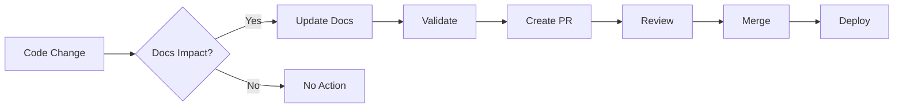
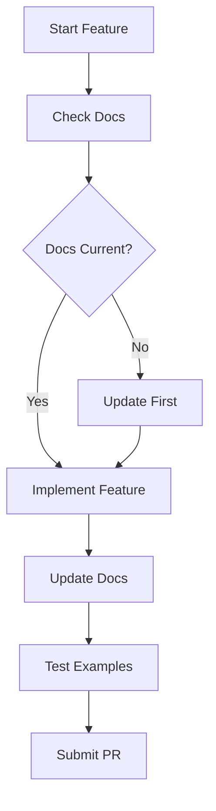

# DOCUMENTATION_UPDATE_WORKFLOWS

*Status: Active*  
*Author: Documentation Team*  
*Canonical: Yes*

## Overview

Documentation for DOCUMENTATION_UPDATE_WORKFLOWS

---
# Documentation Update Workflows

> Standard operating procedures for documentation updates  
> Version: 1.0.0 | Last Updated: January 2025

## 📋 Table of Contents

1. [Update Types](#update-types)
2. [Standard Workflows](#standard-workflows)
3. [Emergency Procedures](#emergency-procedures)
4. [Automation Workflows](#automation-workflows)
5. [Quality Gates](#quality-gates)
6. [Team Workflows](#team-workflows)

## Update Types

### 1. Routine Updates
- **Frequency**: As code changes
- **SLA**: Within same PR
- **Approval**: Standard review

### 2. Scheduled Updates
- **Frequency**: Weekly/Monthly
- **SLA**: Per maintenance schedule
- **Approval**: Batch review

### 3. Emergency Updates
- **Frequency**: As needed
- **SLA**: <2 hours
- **Approval**: Single reviewer

### 4. Major Revisions
- **Frequency**: Quarterly
- **SLA**: 1-2 weeks
- **Approval**: Multiple reviewers

## Standard Workflows

### Workflow 1: Code-Driven Documentation Update



#### Steps:

1. **Identify Documentation Impact**
   ```bash
   # Check which docs reference changed code
   npm run docs:impact --files src/changed-file.ts
   ```

2. **Update Documentation**
   ```bash
   # Open affected docs
   code $(npm run docs:impact --files src/changed-file.ts --format list)
   ```

3. **Validate Changes**
   ```bash
   # Run validation
   npm run docs:validate:changed
   npm run docs:test:examples
   ```

4. **Submit PR**
   ```markdown
   PR Title: feat: update service with docs
   
   Changes:
   - Updated service implementation
   - Updated API documentation
   - Added new examples
   - Fixed broken references
   
   Docs: ✅ Updated
   ```

### Workflow 2: Documentation-Only Update

```yaml
# .github/workflows/doc-update.yml
name: Documentation Update

on:
  pull_request:
    paths:
      - 'docs/**'
      - '*.md'

jobs:
  validate:
    runs-on: ubuntu-latest
    steps:
      - uses: actions/checkout@v3
      
      - name: Setup
        run: npm ci
        
      - name: Validate Documentation
        run: |
          npm run docs:validate
          npm run docs:spell
          npm run docs:links
          
      - name: Test Examples
        run: npm run docs:test:examples
        
      - name: Check Formatting
        run: npm run docs:format:check
        
      - name: Generate Preview
        run: |
          npm run docs:build
          echo "Preview: ${{ steps.deploy.outputs.url }}"
```

### Workflow 3: Batch Updates

For weekly maintenance:

```bash
#!/bin/bash
# scripts/weekly-doc-update.sh

echo "🔄 Starting weekly documentation update..."

# 1. Update dependencies
echo "📦 Checking for outdated version references..."
npm run docs:update:versions

# 2. Fix broken links
echo "🔗 Fixing broken links..."
npm run docs:fix:links

# 3. Update timestamps
echo "📅 Updating last modified dates..."
npm run docs:update:timestamps

# 4. Generate reports
echo "📊 Generating update report..."
npm run docs:report:updates > updates-$(date +%Y%m%d).md

# 5. Create PR if changes
if [[ $(git status --porcelain | wc -l) -gt 0 ]]; then
  git checkout -b docs/weekly-update-$(date +%Y%m%d)
  git add .
  git commit -m "docs: weekly maintenance update

- Updated version references
- Fixed broken links  
- Updated timestamps
- See updates-$(date +%Y%m%d).md for details"
  
  git push origin docs/weekly-update-$(date +%Y%m%d)
  gh pr create --title "docs: weekly maintenance update" \
    --body "Automated weekly documentation maintenance" \
    --label documentation,automated
fi
```

## Emergency Procedures

### Critical Documentation Error

When documentation causes production issues:

```bash
# 1. Create emergency fix branch
git checkout -b docs/emergency-fix

# 2. Make minimal fix
vim docs/affected-file.md

# 3. Quick validation
npm run docs:validate:single docs/affected-file.md

# 4. Direct commit (with approval)
git add docs/affected-file.md
git commit -m "docs: emergency fix for production issue"

# 5. Push and merge
git push origin docs/emergency-fix
gh pr create --title "🚨 Emergency doc fix" \
  --body "Fixes critical documentation error affecting production" \
  --label emergency,documentation

# 6. Fast-track merge
gh pr merge --squash --admin
```

### Rollback Procedure

If documentation update causes issues:

```bash
# 1. Identify problematic commit
git log --oneline docs/

# 2. Revert the commit
git revert <commit-hash>

# 3. Validate rollback
npm run docs:validate

# 4. Push revert
git push origin main
```

## Automation Workflows

### Auto-Update Workflow

```typescript
// scripts/auto-update-docs.ts
import { updateDocs } from './lib/updater';

export async function autoUpdateWorkflow() {
  const updates = await detectUpdates({
    checkVersions: true,
    checkLinks: true,
    checkExamples: true,
    checkReferences: true
  });
  
  for (const update of updates) {
    switch (update.type) {
      case 'version':
        await updateVersionReference(update);
        break;
      case 'link':
        await fixBrokenLink(update);
        break;
      case 'example':
        await updateCodeExample(update);
        break;
      case 'reference':
        await updateCrossReference(update);
        break;
    }
  }
  
  if (updates.length > 0) {
    await createPullRequest({
      title: 'docs: automated updates',
      body: generateUpdateSummary(updates),
      labels: ['documentation', 'automated']
    });
  }
}

// Run daily via GitHub Actions
```

### API Documentation Generation

```yaml
# .github/workflows/api-docs-gen.yml
name: Generate API Documentation

on:
  push:
    paths:
      - 'src/api/**/*.ts'
      - 'src/types/**/*.ts'

jobs:
  generate:
    runs-on: ubuntu-latest
    steps:
      - uses: actions/checkout@v3
      
      - name: Generate API Docs
        run: |
          npm run docs:generate:api
          npm run docs:generate:types
          
      - name: Check for changes
        id: changes
        run: |
          echo "::set-output name=count::$(git status --porcelain | wc -l)"
          
      - name: Create PR
        if: steps.changes.outputs.count > 0
        uses: peter-evans/create-pull-request@v4
        with:
          title: 'docs: update API documentation'
          commit-message: 'docs: auto-generate API documentation'
          branch: docs/api-update
          labels: documentation,automated
```

## Quality Gates

### Pre-Commit Checks

```bash
# .husky/pre-commit
#!/bin/sh

# Check if docs are affected
if git diff --cached --name-only | grep -E '\.(md|mdx)$'; then
  echo "📝 Validating documentation..."
  
  # Run validation on staged files
  npm run docs:validate:staged
  
  # Check spelling
  npm run docs:spell:staged
  
  # Verify examples
  npm run docs:test:examples:staged
  
  if [ $? -ne 0 ]; then
    echo "❌ Documentation validation failed"
    exit 1
  fi
fi
```

### PR Checks

```typescript
// .github/checks/documentation.ts
export const documentationChecks = {
  required: [
    {
      name: 'Documentation Updated',
      check: async (pr) => {
        if (hasCodeChanges(pr) && !hasDocChanges(pr)) {
          return {
            passed: false,
            message: 'Code changes require documentation updates'
          };
        }
        return { passed: true };
      }
    },
    {
      name: 'Examples Valid',
      check: async (pr) => {
        const results = await testDocExamples(pr);
        return {
          passed: results.passed === results.total,
          message: `${results.passed}/${results.total} examples valid`
        };
      }
    },
    {
      name: 'Links Valid',
      check: async (pr) => {
        const broken = await checkLinks(pr);
        return {
          passed: broken.length === 0,
          message: broken.length > 0 
            ? `${broken.length} broken links found`
            : 'All links valid'
        };
      }
    }
  ]
};
```

## Team Workflows

### Developer Workflow



### Reviewer Workflow

```markdown
## Documentation Review Checklist

- [ ] **Accuracy**: Information matches implementation
- [ ] **Completeness**: All changes documented
- [ ] **Examples**: Code examples work
- [ ] **Links**: All links valid
- [ ] **Format**: Follows templates
- [ ] **Clarity**: Easy to understand
```

### Documentation Team Workflow

```bash
# Monday: Planning
npm run docs:report:health
npm run docs:plan:week

# Tuesday-Thursday: Updates
npm run docs:update:batch
npm run docs:fix:automated
npm run docs:review:prs

# Friday: Validation & Reporting
npm run docs:validate:all
npm run docs:report:weekly
npm run docs:metrics:publish
```

## Workflow Automation Scripts

### Update Detection

```typescript
// scripts/detect-updates.ts
export async function detectRequiredUpdates() {
  const updates = [];
  
  // Check for outdated versions
  const versionUpdates = await findOutdatedVersions();
  updates.push(...versionUpdates);
  
  // Check for broken code examples
  const exampleUpdates = await findBrokenExamples();
  updates.push(...exampleUpdates);
  
  // Check for missing documentation
  const missingDocs = await findUndocumentedAPIs();
  updates.push(...missingDocs);
  
  return updates;
}
```

### Batch Processing

```bash
#!/bin/bash
# scripts/batch-update.sh

# Process all pending updates
while IFS= read -r file; do
  echo "Updating $file..."
  
  # Update versions
  sed -i 's/v1\.0\.0/v1.1.0/g' "$file"
  
  # Fix common issues
  npm run docs:fix:single "$file"
  
  # Validate
  npm run docs:validate:single "$file"
  
done < pending-updates.txt

# Create summary
echo "Updated $(wc -l < pending-updates.txt) files"
```

## Monitoring & Metrics

### Update Metrics

Track these KPIs:

| Metric | Target | Current |
|--------|--------|---------|
| Update Latency | <24h | 18h |
| Auto-fix Rate | >80% | 75% |
| PR Approval Time | <4h | 3.5h |
| Failed Validations | <5% | 3% |

### Success Criteria

- All code changes have corresponding doc updates
- Zero broken examples in production
- Documentation always deployable
- Team follows workflows consistently

---

**Remember**: Documentation is a living system. These workflows ensure it stays healthy and useful.

**Support**: Questions about workflows? Ask in #documentation or see [DOCUMENTATION_GOVERNANCE.md](./DOCUMENTATION_GOVERNANCE.md).

---

**Last Updated**: January 2025  
**Owner**: Documentation Team  
**Next Review**: April 2025