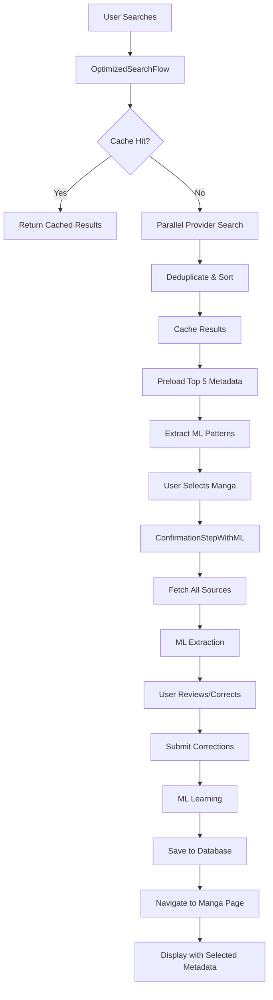

# ML-Enhanced Manga Addition Flow

## Overview

The ML-enhanced manga addition flow provides an intelligent, user-friendly experience for adding manga to the library. It combines optimized search, metadata preloading, ML pattern extraction, and user corrections to ensure high-quality metadata.

## Components

### 1. OptimizedSearchFlow
- **Location**: `/src/components/addManga/optimizedSearchFlow.tsx`
- **Features**:
  - 300ms debounced search
  - Result caching (5-minute TTL)
  - Parallel provider searches
  - Automatic metadata preloading for top 5 results
  - ML pattern extraction in background
  - Visual progress indicators

### 2. ConfirmationStepWithML
- **Location**: `/src/components/addManga/steps/confirmationStepWithML.tsx`
- **Features**:
  - Multiple metadata source selection
  - Field-by-field editing
  - ML teaching mode
  - AI suggestions
  - Confidence scoring
  - User corrections tracking

### 3. IntegratedMangaAddFlow
- **Location**: `/src/components/addManga/IntegratedMangaAddFlow.tsx`
- **Features**:
  - Complete flow integration
  - Step-by-step workflow
  - State management
  - Navigation to manga page

## Data Flow



## Usage Example

```tsx
import { IntegratedMangaAddFlow, useIntegratedMangaAddFlow } from '@/components/addManga/IntegratedMangaAddFlow';

function LibraryPage() {
  const { opened, libraryId, openFlow, closeFlow } = useIntegratedMangaAddFlow();
  const [currentLibraryId] = useState(1);

  return (
    <>
      <Button onClick={() => openFlow(currentLibraryId)}>
        Add Manga
      </Button>

      <IntegratedMangaAddFlow
        libraryId={libraryId}
        opened={opened}
        onClose={closeFlow}
        onSuccess={(mangaId) => {
          console.log(`Manga ${mangaId} added successfully`);
          // Refresh library view
        }}
      />
    </>
  );
}
```

## Metadata Priority

The system uses the following priority for metadata selection:

1. **User Corrections** - Highest priority, always used
2. **ML Extracted** (if confidence > 0.8) - High-confidence ML results
3. **Best Match** - Automatically selected based on scoring
4. **Merged** - Intelligent combination of all sources
5. **Original** - The initially selected manga

## Metadata Scoring Algorithm

```typescript
function calculateSourceScore(source: MetadataSource): number {
  let score = source.confidence * 100;
  
  // Add points for each filled field
  const fields = ['description', 'chapters', 'volumes', 'status', 'genres', 'authors'];
  fields.forEach(field => {
    if (source.data[field]) score += 10;
  });
  
  // Bonus for ML sources if high confidence
  if (source.isML && source.confidence > 0.8) score += 20;
  
  return score;
}
```

## ML Learning Process

### Automatic Learning
- Occurs during every parsing operation
- Extracts patterns from successful metadata extraction
- Updates confidence scores based on success rate

### User Corrections
1. User edits metadata in confirmation screen
2. System tracks what was changed
3. Corrections are submitted with confidence score
4. ML system learns from corrections
5. Patterns evolve based on user feedback

### Pattern Evolution
- Patterns with high success rate get promoted
- Failed patterns get demoted or removed
- New patterns emerge from user corrections
- System adapts to site changes automatically

## Performance Optimizations

### Search Optimization
- **Debouncing**: 300ms delay prevents excessive API calls
- **Caching**: 5-minute cache reduces redundant searches
- **Parallel Queries**: All providers searched simultaneously
- **Preloading**: Top results have metadata ready

### ML Optimization
- **Fast Mode**: Quick extraction for preloading
- **Background Processing**: ML runs without blocking UI
- **Selective Learning**: Only high-confidence corrections are learned
- **Pattern Caching**: Frequently used patterns are cached

## Database Schema

### Manga Table Additions
```sql
ALTER TABLE "Manga" ADD COLUMN "mlCorrected" BOOLEAN DEFAULT false;
ALTER TABLE "Manga" ADD COLUMN "selectedSourceId" TEXT;
ALTER TABLE "Manga" ADD COLUMN "metadataConfidence" DOUBLE PRECISION;
```

### ML Pattern Tables
```prisma
model LearnedPattern {
  id               String   @id @default(cuid())
  category         String
  signature        Json
  selectors        String[]
  features         Json
  featureVector    Float[]
  confidence       Float    @default(0.5)
  accuracy         Float    @default(0.0)
  successCount     Int      @default(0)
  failureCount     Int      @default(0)
  lastUsed         DateTime @default(now())
  createdAt        DateTime @default(now())
  updatedAt        DateTime @updatedAt
  
  variations       PatternVariation[]
  performances     PatternPerformance[]
  learningEvents   PatternLearningEvent[]
  
  @@index([category])
  @@index([confidence])
  @@index([lastUsed])
}
```

## Visual Indicators

### Search Results
- 🟢 Green indicator: Metadata preloaded
- 🔵 Blue spinner: Currently loading metadata
- ⏱️ Clock icon: Metadata being processed

### Confirmation Screen
- 🏆 Best Match: Auto-selected optimal source
- 🔀 Merged: Combined metadata from all sources
- 🤖 ML indicator: ML-extracted metadata
- 📚 Provider icons: Original provider sources
- Confidence badges: Visual confidence scores

### Manga Page
- "ML Corrected" badge: Shows ML was involved
- Source indicator: Shows which source was selected
- Confidence percentage: Displays metadata confidence

## Error Handling

### Search Errors
- Timeout after 10 seconds
- Fallback to cached results if available
- Clear error messages to user

### ML Extraction Errors
- Graceful degradation to original metadata
- Errors logged but don't block flow
- Optional retry mechanism

### Save Errors
- Duplicate detection with friendly messages
- Validation before submission
- Rollback on failure

## Best Practices

1. **Always enable ML preloading** for better user experience
2. **Encourage teaching mode** to improve ML accuracy
3. **Review AI suggestions** before accepting
4. **Use confidence scores** to guide metadata selection
5. **Monitor ML metrics** to track improvement

## Future Enhancements

1. **Batch Learning**: Learn from multiple corrections at once
2. **Cross-User Learning**: Share learned patterns across users
3. **Site-Specific Models**: Specialized models per provider
4. **Confidence Thresholds**: User-configurable confidence levels
5. **Export/Import Patterns**: Share patterns between instances