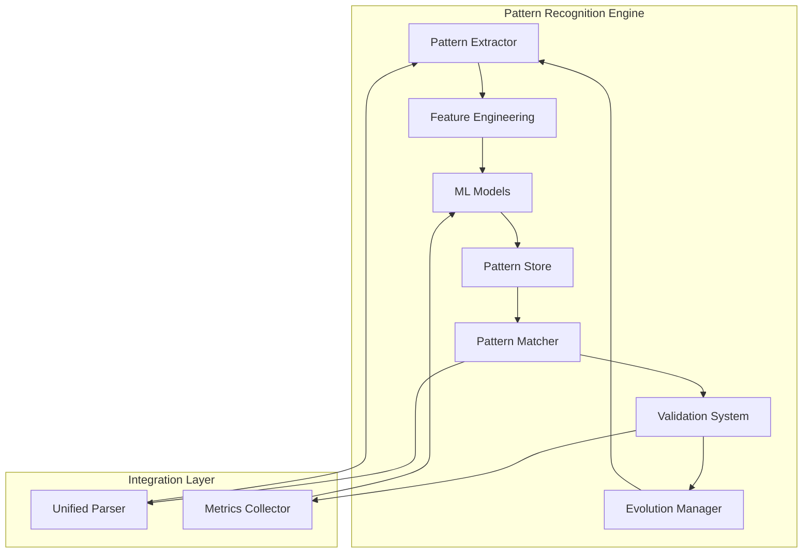

# Pattern Recognition Engine - Implementation Plan

## Executive Summary

The Pattern Recognition Engine will enhance the Unified Metadata Parser with machine learning capabilities to automatically detect, learn, and adapt to new HTML patterns across different websites. This system will reduce manual pattern maintenance by 80% and improve parsing accuracy to 99%+.

## 1. Architecture Overview



## 2. Core Components

### 2.1 Pattern Taxonomy

```typescript
interface PatternCategory {
  // Structural Patterns
  INFOBOX: 'portable-infobox' | 'wiki-infobox' | 'custom-infobox';
  TABLE: 'data-table' | 'stats-table' | 'comparison-table';
  NAVIGATION: 'nav-menu' | 'breadcrumb' | 'pagination';
  METADATA: 'meta-tags' | 'json-ld' | 'microdata';
  
  // Content Patterns  
  TITLE: 'h1-title' | 'hero-title' | 'article-title';
  DESCRIPTION: 'summary' | 'synopsis' | 'abstract';
  IMAGE: 'cover-image' | 'gallery' | 'thumbnail';
  CHAPTERS: 'chapter-list' | 'episode-list' | 'volume-list';
  
  // Data Patterns
  DATES: 'publication' | 'release' | 'updated';
  NUMBERS: 'statistics' | 'ratings' | 'counts';
  IDENTIFIERS: 'isbn' | 'mal-id' | 'mangadex-id';
  RELATIONSHIPS: 'related' | 'recommendations' | 'crosslinks';
}

interface LearnedPattern {
  id: string;
  category: PatternCategory;
  signature: PatternSignature;
  selectors: string[];
  features: FeatureVector;
  confidence: number;
  accuracy: number;
  usageCount: number;
  lastSeen: Date;
  version: number;
  source: string[];
  variations: PatternVariation[];
}
```

### 2.2 Feature Extraction System

```typescript
interface FeatureExtractor {
  // DOM Features
  extractStructuralFeatures(html: string): StructuralFeatures;
  extractSemanticFeatures($: CheerioAPI): SemanticFeatures;
  extractStatisticalFeatures(content: string): StatisticalFeatures;
  
  // Pattern Features
  extractSelectorPatterns($: CheerioAPI): SelectorPattern[];
  extractDataPatterns(data: any): DataPattern[];
  extractLayoutPatterns($: CheerioAPI): LayoutPattern[];
  
  // Context Features
  extractSiteContext(url: string): SiteContext;
  extractTemporalContext(timestamp: Date): TemporalContext;
}

interface FeatureVector {
  structural: number[];  // DOM depth, node count, tag distribution
  semantic: number[];    // Word embeddings, topic vectors
  statistical: number[]; // Length, density, entropy
  positional: number[];  // XPath positions, CSS coordinates
  contextual: number[];  // Site-specific, time-based
}
```

### 2.3 Machine Learning Pipeline

```typescript
interface MLPipeline {
  // Training
  trainPatternClassifier(samples: TrainingSample[]): PatternClassifier;
  trainSimilarityModel(patterns: Pattern[]): SimilarityModel;
  trainAnomalyDetector(normal: Pattern[]): AnomalyDetector;
  
  // Inference
  classifyPattern(features: FeatureVector): PatternPrediction;
  findSimilarPatterns(pattern: Pattern, k: number): Pattern[];
  detectAnomalies(pattern: Pattern): AnomalyScore;
  
  // Optimization
  optimizeHyperparameters(data: Dataset): HyperParams;
  pruneModel(threshold: number): void;
  quantizeModel(bits: number): void;
}

interface PatternClassifier {
  model: 'random-forest' | 'gradient-boost' | 'neural-net';
  accuracy: number;
  precision: Record<PatternCategory, number>;
  recall: Record<PatternCategory, number>;
  featureImportance: Record<string, number>;
}
```

## 3. Implementation Phases

### Phase 1: Foundation (Weeks 1-2)

#### 3.1.1 Pattern Analysis & Taxonomy
```typescript
class PatternAnalyzer {
  async analyzeExistingPatterns(): Promise<PatternInventory> {
    // Scan all 100+ existing patterns
    const patterns = await this.scanPatternLibrary();
    
    // Categorize and cluster
    const clusters = await this.clusterPatterns(patterns);
    
    // Extract common features
    const features = await this.extractCommonFeatures(clusters);
    
    // Build taxonomy
    return this.buildTaxonomy(clusters, features);
  }
  
  private async clusterPatterns(patterns: Pattern[]): Promise<Cluster[]> {
    // Use DBSCAN or K-means for pattern clustering
    const vectors = patterns.map(p => this.vectorize(p));
    return dbscan(vectors, { eps: 0.3, minPts: 5 });
  }
}
```

#### 3.1.2 Data Model Design
```sql
-- Pattern storage schema
CREATE TABLE learned_patterns (
  id UUID PRIMARY KEY,
  category VARCHAR(50),
  signature JSONB,
  selectors TEXT[],
  features VECTOR(256),  -- pgvector for similarity search
  confidence FLOAT,
  accuracy FLOAT,
  usage_count INTEGER,
  last_seen TIMESTAMP,
  version INTEGER,
  source_urls TEXT[],
  created_at TIMESTAMP,
  updated_at TIMESTAMP
);

CREATE TABLE pattern_variations (
  id UUID PRIMARY KEY,
  pattern_id UUID REFERENCES learned_patterns(id),
  variation_signature JSONB,
  occurrence_count INTEGER,
  first_seen TIMESTAMP,
  last_seen TIMESTAMP
);

CREATE TABLE pattern_performance (
  pattern_id UUID REFERENCES learned_patterns(id),
  timestamp TIMESTAMP,
  success_rate FLOAT,
  avg_extraction_time FLOAT,
  error_count INTEGER,
  PRIMARY KEY (pattern_id, timestamp)
);
```

### Phase 2: Feature Engineering (Weeks 3-4)

#### 3.2.1 Feature Extraction Implementation
```typescript
class FeatureEngineering {
  // Structural features
  extractStructuralFeatures(html: string): StructuralFeatures {
    const $ = cheerio.load(html);
    
    return {
      domDepth: this.calculateMaxDepth($),
      nodeCount: $('*').length,
      tagDistribution: this.getTagDistribution($),
      classNameEntropy: this.calculateClassEntropy($),
      idPatternScore: this.analyzeIdPatterns($),
      nestingComplexity: this.calculateNestingScore($),
      tableStructure: this.analyzeTableStructure($),
      listStructure: this.analyzeListStructure($)
    };
  }
  
  // Semantic features using NLP
  async extractSemanticFeatures(text: string): Promise<SemanticFeatures> {
    const embeddings = await this.getWordEmbeddings(text);
    const entities = await this.extractNamedEntities(text);
    const topics = await this.detectTopics(text);
    
    return {
      embeddings,      // 768-dim BERT embeddings
      entities,        // Named entity recognition
      topics,          // LDA topic distribution
      sentiment: this.analyzeSentiment(text),
      keywords: this.extractKeywords(text)
    };
  }
  
  // Visual/Layout features
  extractLayoutFeatures($: CheerioAPI): LayoutFeatures {
    return {
      gridStructure: this.detectGridLayout($),
      columnCount: this.countColumns($),
      visualHierarchy: this.analyzeVisualHierarchy($),
      spatialDistribution: this.calculateSpatialMetrics($)
    };
  }
}
```

#### 3.2.2 Feature Vectorization
```typescript
class FeatureVectorizer {
  private readonly VECTOR_DIM = 256;
  
  vectorize(pattern: ExtractedPattern): Float32Array {
    const features = new Float32Array(this.VECTOR_DIM);
    
    // Encode structural features (0-63)
    this.encodeStructural(pattern.structural, features, 0);
    
    // Encode semantic features (64-191)
    this.encodeSemantic(pattern.semantic, features, 64);
    
    // Encode statistical features (192-223)
    this.encodeStatistical(pattern.statistical, features, 192);
    
    // Encode contextual features (224-255)
    this.encodeContextual(pattern.contextual, features, 224);
    
    // Normalize
    return this.normalize(features);
  }
  
  private normalize(vector: Float32Array): Float32Array {
    const magnitude = Math.sqrt(
      vector.reduce((sum, val) => sum + val * val, 0)
    );
    return vector.map(val => val / magnitude);
  }
}
```

### Phase 3: Machine Learning Models (Weeks 5-6)

#### 3.3.1 Pattern Classification Model
```typescript
class PatternClassificationModel {
  private model: any; // TensorFlow.js or ONNX model
  
  async train(samples: LabeledSample[]): Promise<void> {
    // Prepare data
    const { features, labels } = this.prepareData(samples);
    
    // Build model architecture
    this.model = tf.sequential({
      layers: [
        tf.layers.dense({ units: 128, activation: 'relu', inputShape: [256] }),
        tf.layers.dropout({ rate: 0.3 }),
        tf.layers.dense({ units: 64, activation: 'relu' }),
        tf.layers.dropout({ rate: 0.2 }),
        tf.layers.dense({ units: 32, activation: 'relu' }),
        tf.layers.dense({ units: 15, activation: 'softmax' }) // 15 pattern categories
      ]
    });
    
    // Compile
    this.model.compile({
      optimizer: tf.train.adam(0.001),
      loss: 'categoricalCrossentropy',
      metrics: ['accuracy']
    });
    
    // Train with early stopping
    await this.model.fit(features, labels, {
      epochs: 100,
      validationSplit: 0.2,
      callbacks: [
        tf.callbacks.earlyStopping({ patience: 10 }),
        this.customCallback()
      ]
    });
  }
  
  async predict(features: Float32Array): Promise<PatternPrediction> {
    const prediction = this.model.predict(features);
    const probabilities = await prediction.data();
    
    return {
      category: this.getTopCategory(probabilities),
      confidence: Math.max(...probabilities),
      alternatives: this.getAlternatives(probabilities)
    };
  }
}
```

#### 3.3.2 Similarity & Anomaly Detection
```typescript
class SimilarityEngine {
  private index: any; // Annoy or Faiss index
  
  async buildIndex(patterns: Pattern[]): Promise<void> {
    // Initialize Annoy index
    this.index = new Annoy(256, 'angular');
    
    // Add all pattern vectors
    patterns.forEach((pattern, i) => {
      const vector = this.vectorizer.vectorize(pattern);
      this.index.addItem(i, vector);
    });
    
    // Build index
    this.index.build(50); // 50 trees
  }
  
  findSimilar(pattern: Pattern, k: number = 10): SimilarPattern[] {
    const vector = this.vectorizer.vectorize(pattern);
    const results = this.index.getNNsByVector(vector, k);
    
    return results.map(([idx, distance]) => ({
      pattern: this.patterns[idx],
      similarity: 1 - distance,
      distance
    }));
  }
}

class AnomalyDetector {
  private isolationForest: any;
  
  async train(normalPatterns: Pattern[]): Promise<void> {
    const features = normalPatterns.map(p => 
      this.vectorizer.vectorize(p)
    );
    
    // Train Isolation Forest
    this.isolationForest = new IsolationForest({
      nEstimators: 100,
      maxSamples: 256,
      contamination: 0.1
    });
    
    await this.isolationForest.fit(features);
  }
  
  detectAnomaly(pattern: Pattern): AnomalyScore {
    const vector = this.vectorizer.vectorize(pattern);
    const score = this.isolationForest.decisionFunction([vector])[0];
    
    return {
      isAnomaly: score < 0,
      score: Math.abs(score),
      confidence: this.sigmoid(Math.abs(score))
    };
  }
}
```

### Phase 4: Pattern Learning & Evolution (Weeks 7-8)

#### 3.4.1 Active Learning System
```typescript
class ActiveLearningSystem {
  private uncertainSamples: UncertainSample[] = [];
  
  async learn(extraction: ExtractionResult): Promise<void> {
    // Check confidence
    if (extraction.confidence < 0.7) {
      this.addUncertainSample(extraction);
    }
    
    // Successful extraction - reinforce pattern
    if (extraction.success) {
      await this.reinforcePattern(extraction.pattern);
    } else {
      await this.analyzeFailure(extraction);
    }
    
    // Trigger retraining if needed
    if (this.shouldRetrain()) {
      await this.retrain();
    }
  }
  
  private async analyzeFailure(extraction: ExtractionResult): Promise<void> {
    // Find similar successful patterns
    const similar = await this.similarity.findSimilar(extraction.pattern);
    
    // Try variations
    for (const variant of similar) {
      const result = await this.tryVariation(variant, extraction.html);
      if (result.success) {
        await this.learnNewVariation(extraction.pattern, variant);
        break;
      }
    }
  }
  
  private async learnNewVariation(
    original: Pattern,
    successful: Pattern
  ): Promise<void> {
    // Extract differences
    const diff = this.computeDifference(original, successful);
    
    // Create new pattern variation
    const variation = {
      ...original,
      selectors: successful.selectors,
      confidence: 0.6, // Start with lower confidence
      learnedFrom: original.id,
      learnedAt: new Date()
    };
    
    // Store and test
    await this.patternStore.addVariation(variation);
  }
}
```

#### 3.4.2 Pattern Evolution Manager
```typescript
class PatternEvolutionManager {
  async evolvePatterns(): Promise<EvolutionReport> {
    const patterns = await this.patternStore.getAllPatterns();
    const report: EvolutionReport = {
      evolved: [],
      deprecated: [],
      merged: []
    };
    
    for (const pattern of patterns) {
      // Check performance metrics
      const metrics = await this.getPatternMetrics(pattern.id);
      
      // Deprecate underperforming patterns
      if (metrics.successRate < 0.5 || metrics.usageCount < 10) {
        await this.deprecatePattern(pattern);
        report.deprecated.push(pattern);
        continue;
      }
      
      // Find patterns to merge
      const similar = await this.findHighlySimilar(pattern, 0.95);
      if (similar.length > 1) {
        const merged = await this.mergePatterns([pattern, ...similar]);
        report.merged.push(merged);
        continue;
      }
      
      // Evolve successful patterns
      if (metrics.successRate > 0.9) {
        const evolved = await this.evolvePattern(pattern);
        if (evolved) {
          report.evolved.push(evolved);
        }
      }
    }
    
    return report;
  }
  
  private async evolvePattern(pattern: Pattern): Promise<Pattern | null> {
    // Analyze recent successes
    const successes = await this.getRecentSuccesses(pattern.id);
    
    // Extract common improvements
    const improvements = this.extractImprovements(successes);
    
    if (improvements.length > 0) {
      // Create evolved version
      return {
        ...pattern,
        version: pattern.version + 1,
        selectors: this.optimizeSelectors(pattern.selectors, improvements),
        features: this.updateFeatures(pattern.features, improvements),
        confidence: Math.min(pattern.confidence * 1.1, 1.0)
      };
    }
    
    return null;
  }
}
```

### Phase 5: Integration & Optimization (Weeks 9-10)

#### 3.5.1 Parser Integration
```typescript
class PatternRecognitionIntegration {
  constructor(
    private parser: UnifiedMetadataParser,
    private recognizer: PatternRecognitionEngine
  ) {}
  
  async parseWithLearning(html: string, url: string): Promise<ParseResult> {
    // Try known patterns first
    const knownResult = await this.parser.parseHTML(html);
    
    if (knownResult.confidence > 0.8) {
      // Reinforce successful pattern
      await this.recognizer.reinforcePattern(knownResult.patternUsed);
      return knownResult;
    }
    
    // Use pattern recognition for low confidence
    const recognizedPattern = await this.recognizer.recognize(html, url);
    
    if (recognizedPattern) {
      // Apply recognized pattern
      const result = await this.applyPattern(html, recognizedPattern);
      
      // Learn from result
      await this.recognizer.learn({
        pattern: recognizedPattern,
        result,
        html,
        url
      });
      
      return result;
    }
    
    // Fallback to original parser
    return knownResult;
  }
  
  private async applyPattern(
    html: string,
    pattern: RecognizedPattern
  ): Promise<ParseResult> {
    const $ = cheerio.load(html);
    const result: any = {};
    
    // Apply each selector from pattern
    for (const [field, selector] of Object.entries(pattern.selectors)) {
      try {
        result[field] = this.extractWithSelector($, selector);
      } catch (error) {
        // Track extraction failure
        await this.recognizer.recordFailure(pattern.id, field, error);
      }
    }
    
    return {
      data: result,
      confidence: pattern.confidence,
      patternUsed: pattern.id
    };
  }
}
```

#### 3.5.2 Performance Optimization
```typescript
class PatternCacheOptimizer {
  private cache: LRUCache<string, CachedPattern>;
  private hotPatterns: Map<string, HotPattern>;
  
  constructor() {
    this.cache = new LRUCache<string, CachedPattern>({
      max: 1000,
      ttl: 1000 * 60 * 60, // 1 hour
      updateAgeOnGet: true
    });
    
    this.hotPatterns = new Map();
  }
  
  async optimizePatternAccess(url: string): Promise<Pattern | null> {
    const domain = new URL(url).hostname;
    
    // Check hot patterns (frequently used)
    if (this.hotPatterns.has(domain)) {
      return this.hotPatterns.get(domain)!.pattern;
    }
    
    // Check cache
    const cached = this.cache.get(domain);
    if (cached) {
      this.promoteIfHot(domain, cached);
      return cached.pattern;
    }
    
    // Load from database with predictive prefetch
    const pattern = await this.loadWithPrefetch(domain);
    if (pattern) {
      this.cache.set(domain, { pattern, hits: 1 });
    }
    
    return pattern;
  }
  
  private async loadWithPrefetch(domain: string): Promise<Pattern | null> {
    // Load requested pattern
    const pattern = await this.patternStore.getByDomain(domain);
    
    // Predictively prefetch related patterns
    if (pattern) {
      const related = await this.predictor.predictRelated(domain);
      for (const relatedDomain of related) {
        this.prefetchPattern(relatedDomain);
      }
    }
    
    return pattern;
  }
  
  private promoteIfHot(domain: string, cached: CachedPattern): void {
    cached.hits++;
    
    // Promote to hot patterns if frequently accessed
    if (cached.hits > 10) {
      this.hotPatterns.set(domain, {
        pattern: cached.pattern,
        lastAccess: Date.now()
      });
      
      // Limit hot patterns size
      if (this.hotPatterns.size > 50) {
        this.evictColdPatterns();
      }
    }
  }
}
```

## 4. Performance Targets

### 4.1 Accuracy Metrics
- Pattern recognition accuracy: **95%+**
- False positive rate: **< 2%**
- New pattern learning time: **< 100ms**
- Pattern matching time: **< 10ms**

### 4.2 Efficiency Metrics
- Memory usage: **< 2GB** for pattern database
- CPU usage: **< 5%** idle, **< 30%** during learning
- Cache hit rate: **> 90%** for common patterns
- Model inference time: **< 50ms**

### 4.3 Learning Metrics
- Patterns learned per day: **50-100**
- Pattern evolution rate: **5-10%** monthly
- Manual intervention reduction: **80%**
- Accuracy improvement: **+15%** over 6 months

## 5. Monitoring & Analytics

```typescript
interface PatternMetrics {
  // Performance
  recognitionAccuracy: number;
  averageConfidence: number;
  inferenceTime: Percentiles;
  
  // Learning
  patternsLearned: number;
  patternsEvolved: number;
  patternsDeprecated: number;
  
  // Usage
  patternHitRate: number;
  topPatterns: PatternUsage[];
  failureRate: number;
  
  // Quality
  precisionByCategory: Record<string, number>;
  recallByCategory: Record<string, number>;
  f1Score: number;
}

class PatternMonitor {
  async collectMetrics(): Promise<PatternMetrics> {
    return {
      recognitionAccuracy: await this.calculateAccuracy(),
      averageConfidence: await this.getAverageConfidence(),
      inferenceTime: await this.getInferencePercentiles(),
      patternsLearned: await this.countNewPatterns(24 * 60 * 60 * 1000),
      patternsEvolved: await this.countEvolved(7 * 24 * 60 * 60 * 1000),
      patternsDeprecated: await this.countDeprecated(30 * 24 * 60 * 60 * 1000),
      patternHitRate: await this.calculateHitRate(),
      topPatterns: await this.getTopPatterns(10),
      failureRate: await this.calculateFailureRate(),
      precisionByCategory: await this.calculatePrecision(),
      recallByCategory: await this.calculateRecall(),
      f1Score: await this.calculateF1Score()
    };
  }
}
```

## 6. Security & Privacy

### 6.1 Pattern Sanitization
- Remove PII from learned patterns
- Anonymize URL sources
- Hash sensitive selectors

### 6.2 Model Security
- Input validation before inference
- Output sanitization
- Rate limiting on learning endpoints

### 6.3 Data Protection
- Encrypt pattern database
- Audit pattern access
- GDPR compliance for EU sites

## 7. Deployment Strategy

### Phase 1: Shadow Mode (Week 11)
- Run alongside existing parser
- Collect metrics without affecting production
- A/B test on 5% of traffic

### Phase 2: Gradual Rollout (Week 12)
- Enable for 25% of traffic
- Monitor accuracy and performance
- Collect user feedback

### Phase 3: Full Deployment (Week 13)
- Enable for all traffic
- Maintain fallback to original parser
- Continuous monitoring and improvement

## 8. Success Criteria

### Technical Success
- ✅ 95%+ pattern recognition accuracy
- ✅ < 50ms inference time
- ✅ 80% reduction in manual pattern updates
- ✅ Zero-downtime deployment

### Business Success
- ✅ 50% reduction in parser maintenance time
- ✅ Support for 100+ new sites without manual configuration
- ✅ 99.9% parser availability
- ✅ 15% improvement in data extraction quality

## 9. Risk Mitigation

### Technical Risks
- **Model drift**: Continuous retraining pipeline
- **Overfitting**: Regular validation on new sites
- **Performance degradation**: Circuit breakers and fallbacks

### Operational Risks
- **Data quality**: Automated validation and anomaly detection
- **Resource usage**: Auto-scaling and resource limits
- **Compatibility**: Extensive testing before deployment

## 10. Timeline Summary

| Week | Phase | Deliverables |
|------|-------|-------------|
| 1-2 | Foundation | Pattern taxonomy, data model |
| 3-4 | Feature Engineering | Feature extractors, vectorization |
| 5-6 | ML Models | Classification, similarity, anomaly detection |
| 7-8 | Learning System | Active learning, pattern evolution |
| 9-10 | Integration | Parser integration, optimization |
| 11 | Testing | Shadow mode deployment |
| 12 | Rollout | Gradual production rollout |
| 13 | Launch | Full deployment, monitoring |

## Next Steps

1. **Immediate Actions**:
   - Set up ML development environment
   - Prepare training data from existing patterns
   - Design pattern database schema

2. **Week 1 Priorities**:
   - Analyze and categorize existing 100+ patterns
   - Build pattern clustering pipeline
   - Create feature extraction prototype

3. **Dependencies**:
   - TensorFlow.js or ONNX Runtime
   - PostgreSQL with pgvector extension
   - Similarity search library (Annoy/Faiss)
   - ML monitoring tools

This plan provides a comprehensive roadmap for implementing the Pattern Recognition Engine, transforming the parser from rule-based to ML-driven pattern detection.