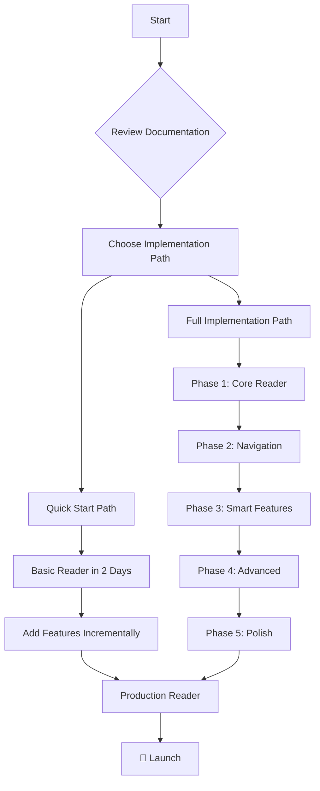
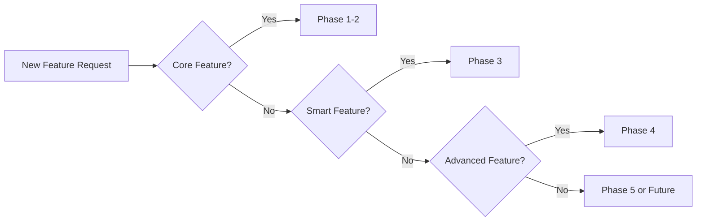
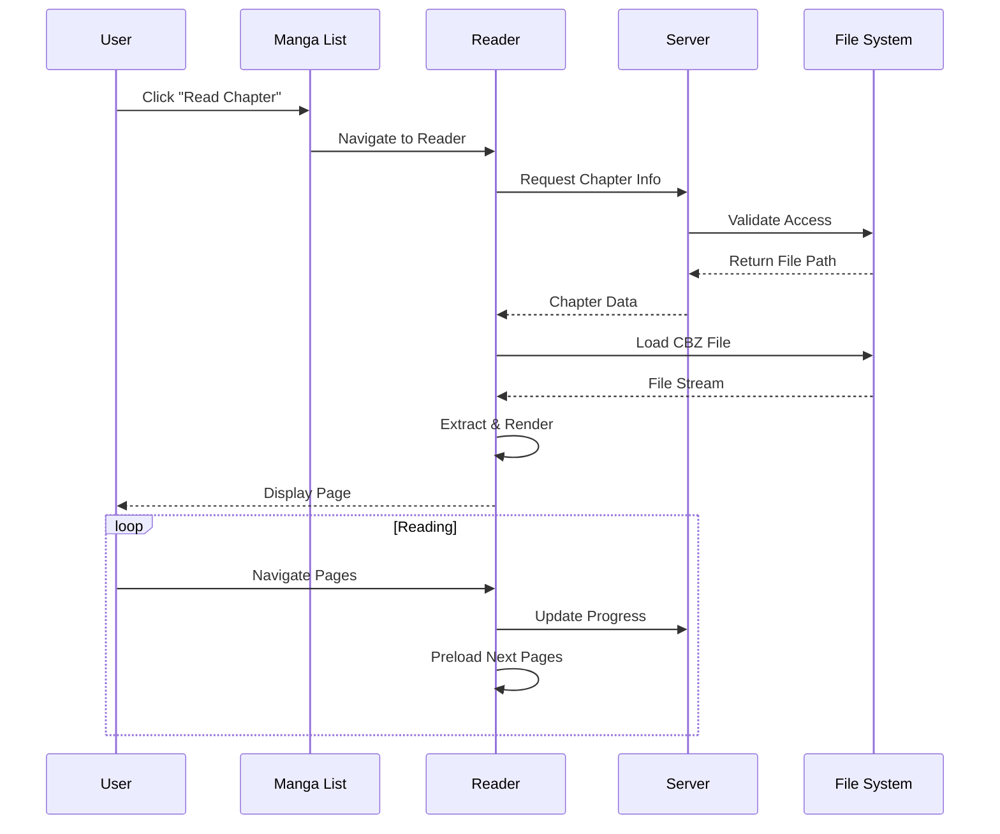

# VISUAL_ROADMAP

*Status: Active*  
*Author: Documentation Team*  
*Canonical: Yes*

## Overview

Documentation for VISUAL_ROADMAP

---
# Native Reader Integration - Visual Roadmap

## 📚 Reader Integration Journey



## 📅 Timeline Overview

### Week-by-Week Breakdown

```
Week 1  │ ████████░░░░░░░░░░░░░░░░ │ Setup & Basic File Loading
Week 2  │ ████████████░░░░░░░░░░░░ │ Page Rendering & Navigation  
Week 3  │ ████████████████░░░░░░░░ │ Progress Tracking & CBZ Support
Week 4  │ ████████████████████░░░░ │ Multiple Reading Modes
Week 5  │ ████████████████████░░░░ │ Gestures & Settings
Week 6  │ ████████████████████░░░░ │ Smart Preloading
Week 7  │ ████████████████████░░░░ │ Panel Detection
Week 8  │ ████████████████████░░░░ │ Analytics & Bookmarks
Week 9  │ ████████████████████░░░░ │ OCR Integration
Week 10 │ ████████████████████░░░░ │ Social Features
Week 11 │ ████████████████████░░░░ │ Export & Sharing
Week 12 │ ████████████████████████ │ Performance Optimization
Week 13 │ ████████████████████████ │ Testing & Documentation
```

## 🏗️ Architecture Layers

```
┌─────────────────────────────────────────────────────────┐
│                    User Interface Layer                  │
│  ┌─────────────┐ ┌──────────────┐ ┌─────────────────┐ │
│  │   Reader    │ │   Toolbar    │ │    Settings     │ │
│  │   Canvas    │ │  Navigation  │ │     Panel       │ │
│  └─────────────┘ └──────────────┘ └─────────────────┘ │
├─────────────────────────────────────────────────────────┤
│                    Component Layer                       │
│  ┌─────────────┐ ┌──────────────┐ ┌─────────────────┐ │
│  │    Page     │ │   Chapter    │ │   Bookmark      │ │
│  │  Navigator  │ │   Selector   │ │    Manager      │ │
│  └─────────────┘ └──────────────┘ └─────────────────┘ │
├─────────────────────────────────────────────────────────┤
│                    Service Layer                         │
│  ┌─────────────┐ ┌──────────────┐ ┌─────────────────┐ │
│  │    File     │ │  Rendering   │ │    Progress     │ │
│  │   Manager   │ │    Engine    │ │    Tracker      │ │
│  └─────────────┘ └──────────────┘ └─────────────────┘ │
│  ┌─────────────┐ ┌──────────────┐ ┌─────────────────┐ │
│  │  Preloader  │ │     OCR      │ │     Cache       │ │
│  │   Service   │ │   Service    │ │    Manager      │ │
│  └─────────────┘ └──────────────┘ └─────────────────┘ │
├─────────────────────────────────────────────────────────┤
│                     Data Layer                           │
│  ┌─────────────┐ ┌──────────────┐ ┌─────────────────┐ │
│  │   Prisma    │ │   IndexedDB  │ │   File System   │ │
│  │     ORM     │ │    Cache     │ │     Access      │ │
│  └─────────────┘ └──────────────┘ └─────────────────┘ │
└─────────────────────────────────────────────────────────┘
```

## 🎯 Feature Priority Matrix

```
                    High Impact
                         │
    Smart Zoom          │          OCR/Text
    Panel Detection     │          Social Features
    ────────────────────┼────────────────────
    Basic Navigation    │          Themes
    Progress Tracking   │          Animations
                         │
                    Low Impact
    ─────────────────────────────────────────
         Essential              Nice to Have
```

## 📊 Decision Flow



## 🚀 Quick Wins Timeline

### Day 1
- ✅ Basic file structure
- ✅ Reader component shell
- ✅ Simple navigation

### Week 1  
- ✅ CBZ file support
- ✅ Page rendering
- ✅ Keyboard controls
- ✅ Basic progress saving

### Month 1
- ✅ All reading modes
- ✅ Touch gestures  
- ✅ Settings persistence
- ✅ Chapter navigation

### Month 3
- ✅ Smart preloading
- ✅ Panel detection
- ✅ OCR capability
- ✅ Full analytics

## 📈 Success Metrics Dashboard

```
┌─────────────────────────────────────────┐
│          Performance Metrics            │
├─────────────────────────────────────────┤
│ Page Load Time:    [████████░░] 80ms   │
│ Memory Usage:      [██████░░░░] 150MB  │
│ Error Rate:        [██░░░░░░░░] 2%     │
│ Test Coverage:     [█████████░] 92%    │
└─────────────────────────────────────────┘

┌─────────────────────────────────────────┐
│           User Metrics                  │
├─────────────────────────────────────────┤
│ Satisfaction:      [█████████░] 4.6/5  │
│ Feature Adoption:  [████████░░] 78%    │
│ Avg Session:       [████████░░] 12min  │
│ Daily Active:      [███████░░░] 65%    │
└─────────────────────────────────────────┘
```

## 🔄 Integration Flow



## 🛠️ Development Workflow

```
┌──────────────┐     ┌──────────────┐     ┌──────────────┐
│   Feature    │     │   Develop    │     │    Test      │
│   Branch     │────▶│   Component  │────▶│   Feature    │
└──────────────┘     └──────────────┘     └──────────────┘
        │                                          │
        │                                          ▼
┌──────────────┐     ┌──────────────┐     ┌──────────────┐
│   Deploy     │◀────│   Review     │◀────│  Integration │
│   Feature    │     │    Code      │     │    Tests     │
└──────────────┘     └──────────────┘     └──────────────┘
```

## 📝 Documentation Map

```
reader-integration/
├── 📄 README.md ················· Overview & Summary
├── 📋 READER_IMPLEMENTATION_PLAN.md · Full 13-week plan
├── 🔧 TECHNICAL_SPECIFICATIONS.md ··· Component specs
├── 🚀 QUICK_START_GUIDE.md ········· Fast implementation
├── 📊 FEATURE_COMPARISON.md ········· Solution analysis
├── 🔄 MIGRATION_GUIDE.md ··········· Integration steps
└── 🗺️ VISUAL_ROADMAP.md ··········· This document
```

## 🎯 Key Milestones

### Milestone 1: Basic Reader (Week 3)
- ☑️ File loading
- ☑️ Page display
- ☑️ Navigation
- ☑️ Progress tracking

### Milestone 2: Enhanced UX (Week 5)
- ☑️ Multiple modes
- ☑️ Gestures
- ☑️ Settings
- ☑️ Smooth transitions

### Milestone 3: Smart Features (Week 8)  
- ☑️ Intelligent preloading
- ☑️ Panel detection
- ☑️ Analytics
- ☑️ Bookmarks

### Milestone 4: Advanced (Week 11)
- ☑️ OCR integration
- ☑️ Social features
- ☑️ Export options
- ☑️ Note-taking

### Milestone 5: Production (Week 13)
- ☑️ Performance optimized
- ☑️ Fully tested
- ☑️ Documented
- ☑️ Ready to ship

---

## 🚦 Ready to Start?

1. **📖 Read**: Start with the [README](./README.md) for overview
2. **🏃 Quick**: Jump to [Quick Start Guide](./QUICK_START_GUIDE.md) for fast results
3. **📋 Plan**: Review [Implementation Plan](./READER_IMPLEMENTATION_PLAN.md) for full roadmap
4. **🔧 Build**: Check [Technical Specs](./TECHNICAL_SPECIFICATIONS.md) for details
5. **🔄 Integrate**: Follow [Migration Guide](./MIGRATION_GUIDE.md) for integration

**Let's build an amazing manga reading experience! 🎉**
