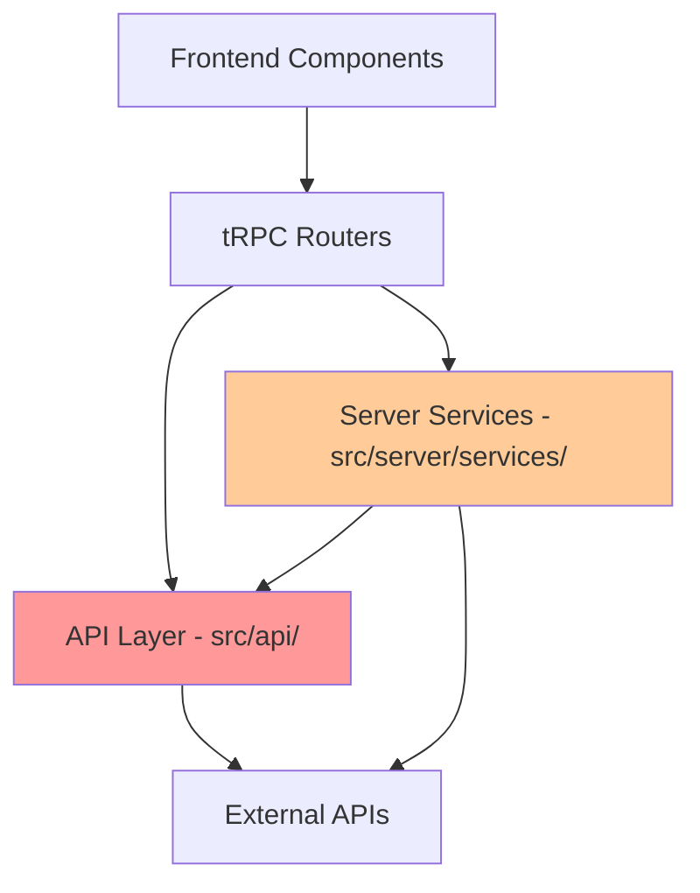

# Active Implementation Analysis: What's Actually Being Used

## Executive Summary

After analyzing imports and usage patterns, the codebase shows a **mixed and inconsistent usage pattern** where both `api/` and `server/` implementations are actively used, often within the same functional area. This creates a complex dependency web that makes refactoring challenging.

## Current Usage Patterns

### 1. Metadata Providers - MIXED USAGE ⚠️

#### API Implementations (Adapters)
Used by server services for:
- **Calendar Services**: Directly import `api/metadataProviders/adapters/`
  - `CalendarProviderAdapters.ts`
  - `ProviderReleaseService.ts`
  - `ReleaseScheduleAggregator.ts`
- **Metadata Service**: Uses adapter pattern from `api/`
  - Creates adapters via `createAniListAdapter()`, `createComicVineAdapter()`, etc.
- **Kapowarr Integration**: Uses `WebsiteProviderAdapter` from `api/`

#### Server Implementations (Services)
Used for:
- **Search Functionality**: `server/services/search/providers/`
  - `AniListProvider` → uses `anilistService` from `server/services/anilist/service`
  - `ComicVineProvider` → uses `comicvineService`
  - `FandomProvider` → uses `fandomService`
- **tRPC Metadata Router**: Directly imports `comicvineService` for specific operations
- **Unified Adapters**: `server/adapters/` create clients from `api/metadataProviders/`

**Key Finding**: The same functionality has TWO active code paths:
```
Frontend → tRPC → server/services/search → server/services/[provider]/service
Frontend → tRPC → server/services/metadata → api/metadataProviders/adapters
```

### 2. Notification System - API DOMINANT ✅

**Primary Implementation**: `api/notifications/`
- **Used by**: 
  - `server/utils/notification.ts`
  - `examples/notification-integration-examples.ts`
- **Entry Point**: `getNotificationService()` from `api/notifications/index.ts`
- **Adapters**: All in `api/notifications/adapters/`

**Server Duplicates**: Exist but appear **UNUSED**
- Files in `server/adapters/notifications/` have no imports
- Server notification services exist but aren't referenced

### 3. Download Clients - API DOMINANT ✅

**Primary Implementation**: `api/downloadClients/`
- **Used by**:
  - `server/trpc/routers/downloadClients.ts`
  - `server/services/download/clientDownload.ts`
- **Clients**: TransmissionClient, DelugeClient, NzbgetClient, SabnzbdClient

**Server Duplicates**: 
- `server/adapters/download/transmission.ts` exists but **UNUSED**
- Exact duplicate of API version with no references

### 4. Configuration Services - SERVER DOMINANT ⚠️

**Primary Implementation**: `server/services/config/`
- Multiple config services per provider/feature
- Each service manages its own configuration
- No centralized configuration management

**Pattern**: Every service has its own `configService.ts`:
```
server/services/anilist/configService.ts
server/services/comicvine/configService.ts
server/services/fandom/configService.ts
... (20+ more)
```

## Component Usage Analysis

### Frontend Components Use:
1. **tRPC hooks** → which route to various implementations
2. **Direct imports** of server types (e.g., `DownloadStatus`)
3. **Custom hooks** like `useProviderSearch` that abstract the provider

### tRPC Routers:
- **search router** → Uses `ProviderRegistry` → server services
- **metadata router** → Mixed: uses both server services and creates new instances
- **downloadClients router** → Uses API clients

## Dependency Flow



## Critical Issues

### 1. Circular Dependencies
- Server services import from API layer
- API layer sometimes references server types
- Creates potential for circular dependency issues

### 2. Inconsistent Entry Points
- Some features use API layer as entry point
- Others use server services directly
- No clear architectural boundary

### 3. Double Instantiation
- Services may be instantiated in both layers
- Potential for duplicate caches and rate limiters
- Memory overhead and synchronization issues

### 4. Maintenance Confusion
- Unclear which implementation to modify
- Bug fixes may need to be applied twice
- Different teams might modify different implementations

## Active vs Inactive Code

### Actively Used (Keep)
```
✅ api/notifications/          - Primary notification system
✅ api/downloadClients/        - Primary download clients
✅ api/metadataProviders/adapters/ - Used by calendar and metadata services
✅ server/services/[provider]/ - Used by search functionality
✅ server/services/config/     - Configuration management
```

### Appears Unused (Can Remove)
```
❌ server/adapters/notifications/ - No imports found
❌ server/adapters/download/transmission.ts - Duplicate, no references
❌ api/metadataProviders/adapters/enhancedAnilistAdapter.ts - No references
❌ api/metadataProviders/adapters/comicvineEnhancedAdapter.ts - No references
❌ api/metadataProviders/adapters/fandomEnhancedAdapter.ts - No references
```

### Conflicted (Both Used)
```
⚠️ api/metadataProviders/anilistClient.ts vs server/services/anilist/service.ts
⚠️ api/metadataProviders/comicvineClient.ts vs server/services/comicvine/service.ts
⚠️ api/metadataProviders/fandomClient.ts vs server/services/fandom/service.ts
```

## Recommendations

### Immediate Actions
1. **Remove unused files** (listed above)
2. **Choose single implementation for metadata providers**:
   - Option A: Use server services everywhere (recommended)
   - Option B: Use API adapters everywhere
3. **Document the chosen pattern** clearly

### Consolidation Strategy

#### For Metadata Providers:
```typescript
// Create a single entry point
// server/services/providers/index.ts
export { anilistService } from '../anilist/service';
export { comicvineService } from '../comicvine/service';
export { fandomService } from '../fandom/service';

// Update all imports to use this single source
```

#### For Notifications:
```typescript
// Already consolidated in api/notifications
// Just remove server/adapters/notifications/
```

#### For Download Clients:
```typescript
// Already consolidated in api/downloadClients
// Just remove server/adapters/download/
```

### Architecture Decision Required

**Critical Decision**: Choose ONE of these patterns:

**Option 1: Server-Centric** (Recommended)
```
Frontend → tRPC → Server Services → External APIs
                      ↓
                  (internal adapters if needed)
```

**Option 2: API-Centric**
```
Frontend → tRPC → API Layer → External APIs
                      ↓
              (server orchestration only)
```

**Option 3: Clear Separation**
```
Frontend → tRPC → Server (orchestration)
                      ↓
                  API Layer (external communication)
                      ↓
                  External APIs
```

## Impact of Current State

### Performance
- **Memory**: ~20-30% overhead from duplicate instances
- **Bundle Size**: Client may include unnecessary server code
- **Caching**: Duplicate caches reduce effectiveness

### Development
- **Velocity**: -30% due to confusion about which code to modify
- **Bugs**: Higher likelihood of incomplete fixes
- **Testing**: Duplicate test suites needed

### Maintenance
- **Technical Debt**: Growing with each feature addition
- **Onboarding**: New developers confused by dual implementations
- **Refactoring**: Extremely difficult due to mixed usage

## Conclusion

The codebase is in a **transitional state** with both old and new implementations active. This creates significant technical debt and confusion. The mixed usage pattern indicates an incomplete migration or architectural refactoring.

**Priority Actions**:
1. Remove clearly unused files (quick win)
2. Choose and document the architectural pattern
3. Consolidate metadata provider implementations
4. Create clear import boundaries
5. Update all imports to use single sources

The current state is functional but inefficient and difficult to maintain. Consolidation would improve performance, reduce bugs, and accelerate development.