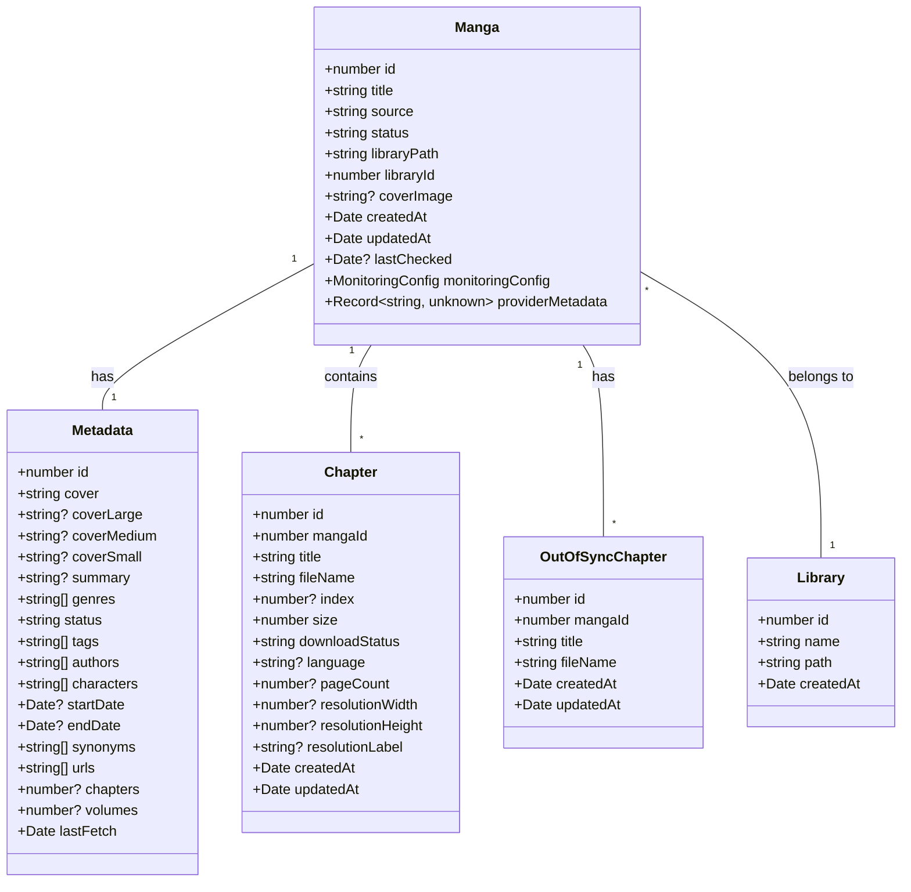
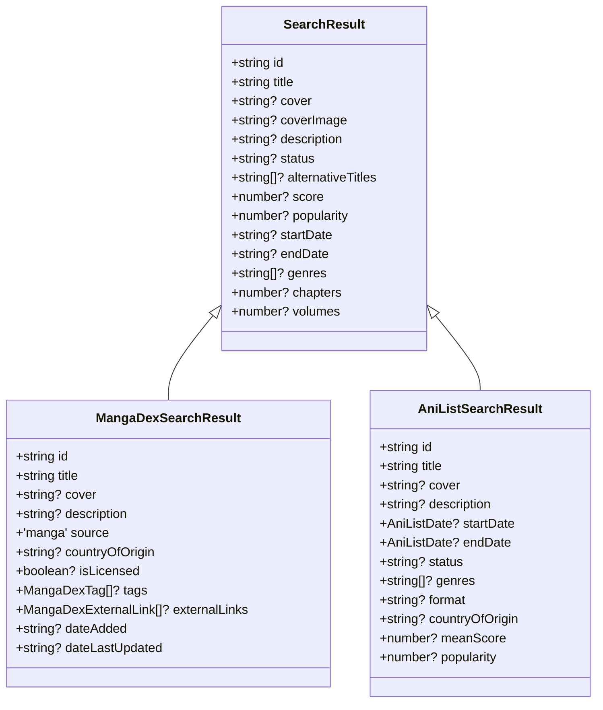
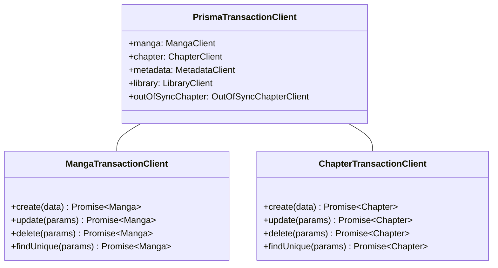
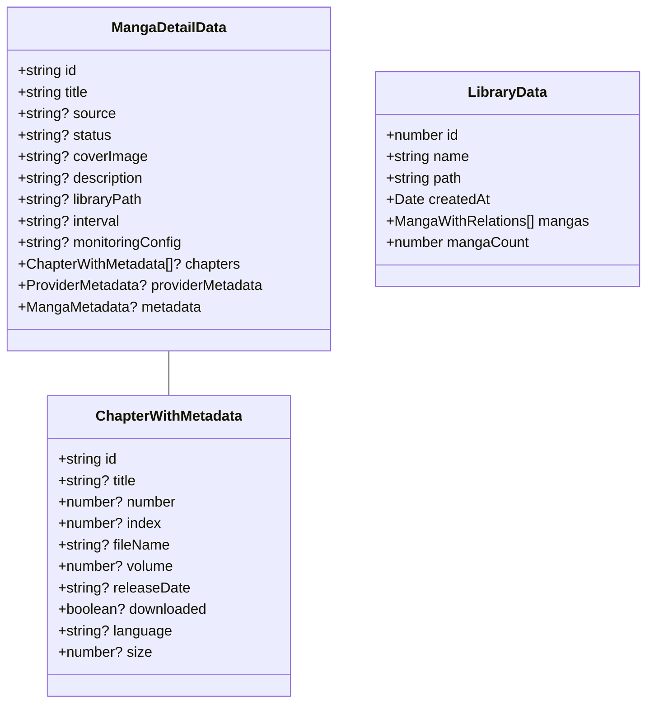
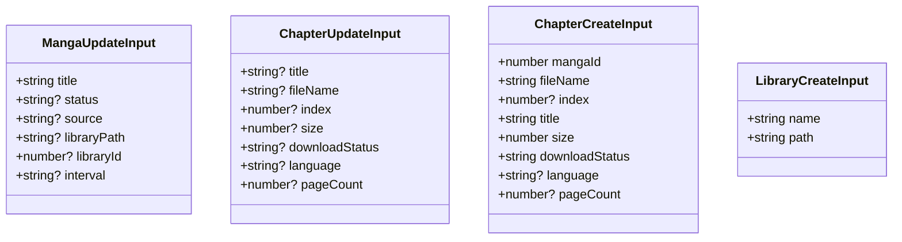
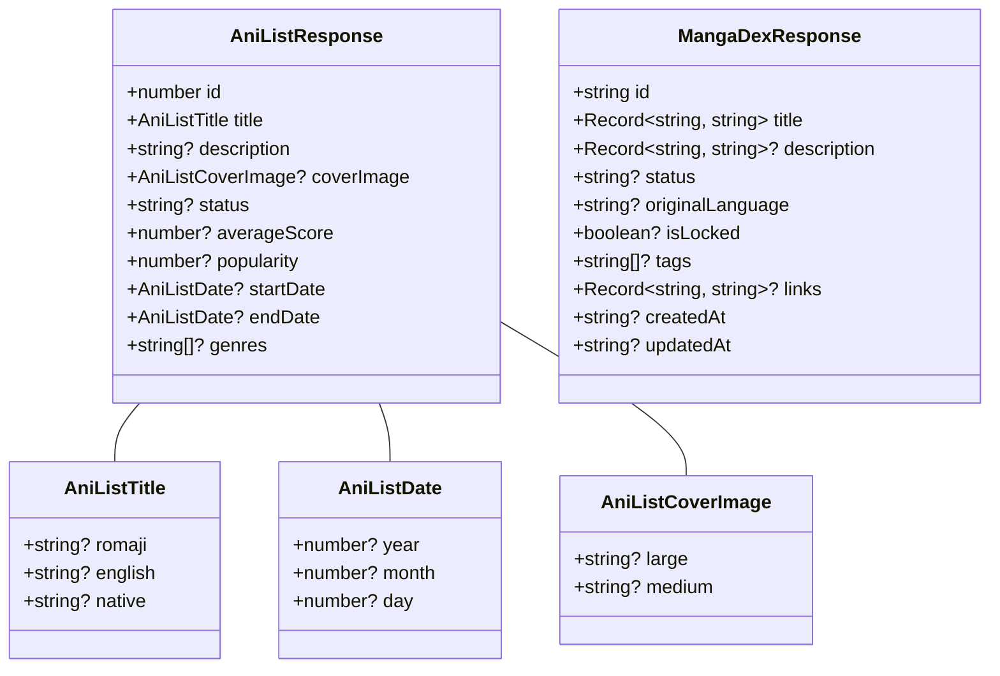
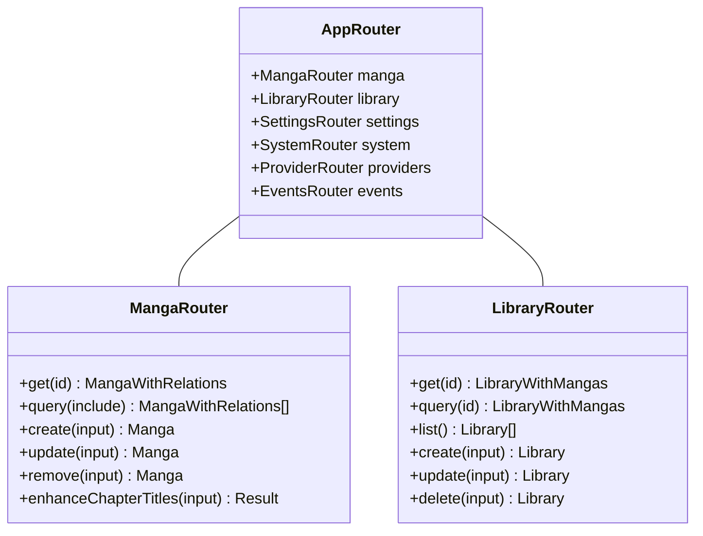
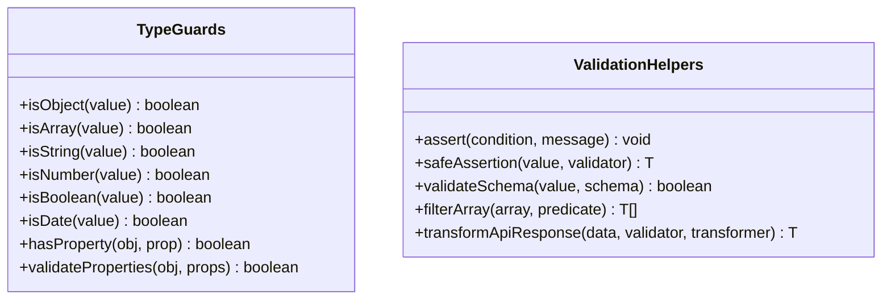
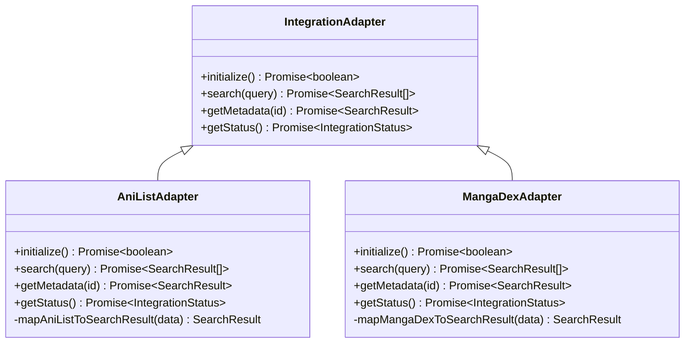
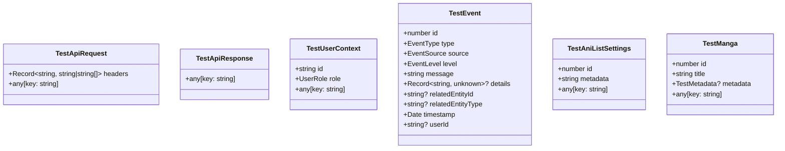

# TypeScript Type Reference Guide

This document provides a visual reference for the key type structures used throughout the Mugiwara-Kaizoku project.

## Core Domain Types

### Manga Data Model

### Search Types

### Transaction Types

## UI Component Types

### Page Component Props

### Form Input Types

## API Types

### Provider API Types

## TRPC Types

### TRPC Router Types

## Utility Types

### Type Guards and Validators

## Integration Types

### Integration Adapter Pattern

## Test Types

### Test Fixtures and Mocks

## Using This Reference

Use this visual type reference to:

1. Understand the relationships between core domain types
2. Identify the required properties for API requests/responses
3. See the inheritance hierarchy of specialized types
4. Ensure consistency when creating new types
5. Find the appropriate type for a given use case

This reference will be updated as the type system evolves.